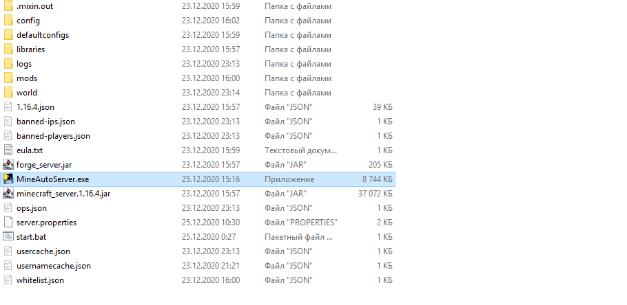
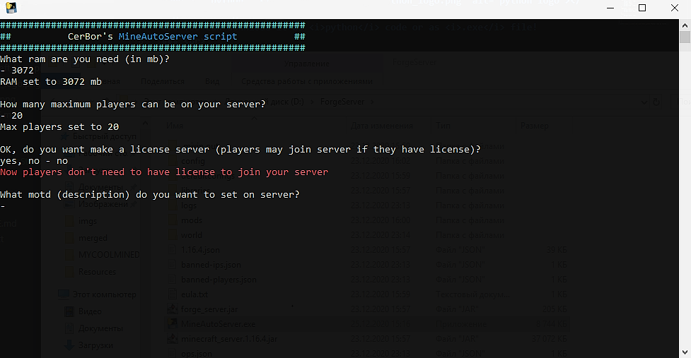
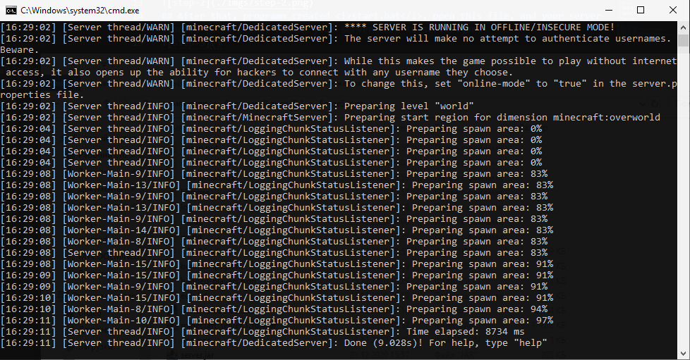

## <div style="display: flex"> MineAutoServer <i style="margin-left: 5px; color: #969696">script</i>  </div>
### Script for easy starting your minecraft server
### <br />
### <br />
# Information
## This script writed on <a href="https://www.python.org" title="Go to python page">```python```</a> </img><text style="margin-left: 10px">language</text>.
### You can download it as <i style="color: #969696">python</i> code or as <i style="color: #969696">.exe</i> file!
### <br>
# Start work
## For start working copy your downloaded script to your server folder

## Then, just start it and answer the questions

## After that, programm created <i style="color: #969696">start.bat</i>, open this file, and your server started (before that rename your server core to server.jar)

## <div></div>
## And if you found some errors, write about it to <a href="https://github.com/CerBor/MineAutoServerScript/issues" title="Go to issues"><i style="color: #969696">issues</i></a>
#### <br />
#### <br />
## In this file were used icons:
####  <a href="https://icons8.com/icon/13441/python">Python icon by Icons8</a>
####  <a href="https://icons8.com/icon/UkpiWnM96dxv/minecraft-logo">Minecraft Logo icon by Icons8</a>